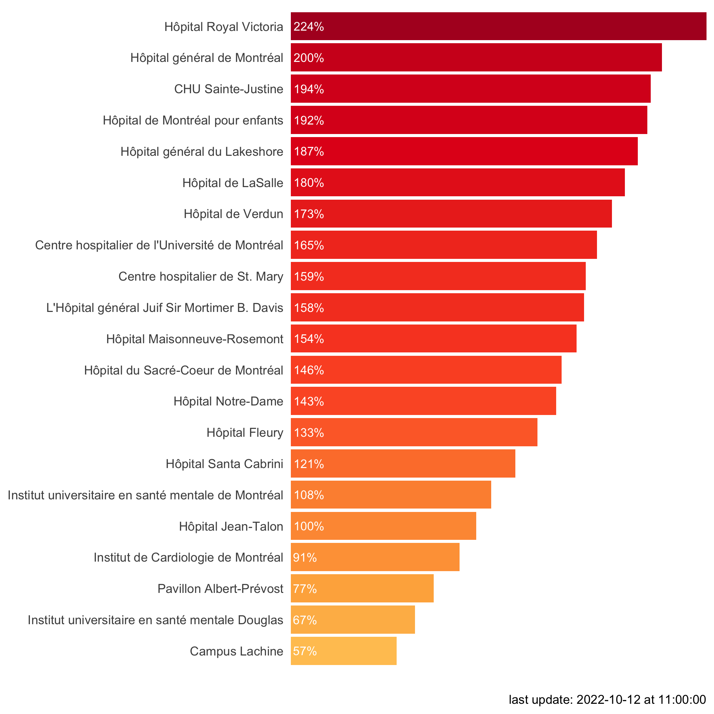

# hospital-occupancy-tracker
reads daily updated content from pdf, extracts and plots data, saves results to csv file
 
tracks occupancy rates in Montreal emergency rooms
 
updates every day at 12:00h

to do: tracker visualization

   

